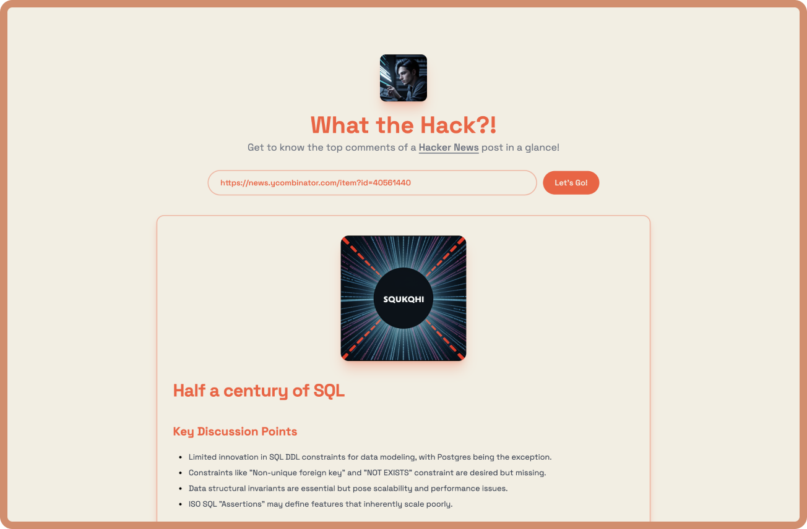

<h1 align="center">What the Hack?!</h1>

Want to stay updated on the latest developer discussions on [HackerNews](https://news.ycombinator.com/)?... Introducing [What the Hack?!](https://wth.lakshb.dev) – a web tool that fetches the top comments from any provided HackerNews post URL. Using Cloudflare workers AI, it delivers a detailed summary of the comments within seconds and generates an illustrative image for the post headline.

So if you're too lazy to read through the comments, or just want to get a quick overview of the discussion, [What the Hack?!](https://wth.lakshb.dev) is the tool for you!

> This repository contains the frontend code for the project. The backend code can be found at [What the Hack?! • Backend](https://github.com/lakshaybhushan/wth-backend)

## Features

- **Instant Comment Summary**: Get a detailed summary of the top comments on any HackerNews post URL.
- **Illustrative Image Generation**: Automatically generate an illustrative image for the post headline.
- **Text Streaming Response**: Get the summary in real-time as the comments are being processed.
- **Mobile Responsive**: Enjoy the same experience across all devices.

## Built With

- Next.js 14
- Tailwind CSS
- Hono
- Cloudflare Workers
- Vercel

## Points to Note

- This project is a very basic implementation of the Cloudflare Workers AI service. The AI service is still in beta (especially modals that I'm using `Meta's Llama 3`[text generation] & `Dreamshaper`[image generation]) and may not be as accurate as expected. The project is intended to showcase the capabilities of the service and may not be suitable for production use.

- If you encounter any issues with the project, please feel free to open an issue or submit a pull request. I would be happy to help you out!.

---

This project was possible thanks to an awesome dev [Dhravya Shah](https://github.com/Dhravya) who built the early implementation of this project on his first live stream. You can check out the stream [here](https://www.youtube.com/live/tWCRWo02F-0?si=RMcSFJGB2QVIZ19r). I built upon his work and added a few more features to the project. Thanks, Dhravya! 🚀
